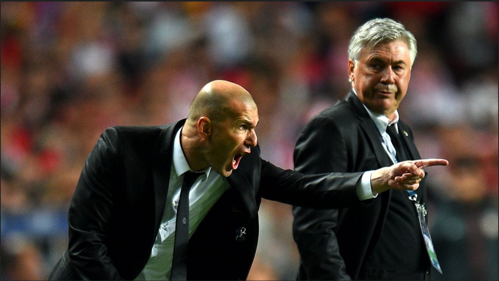
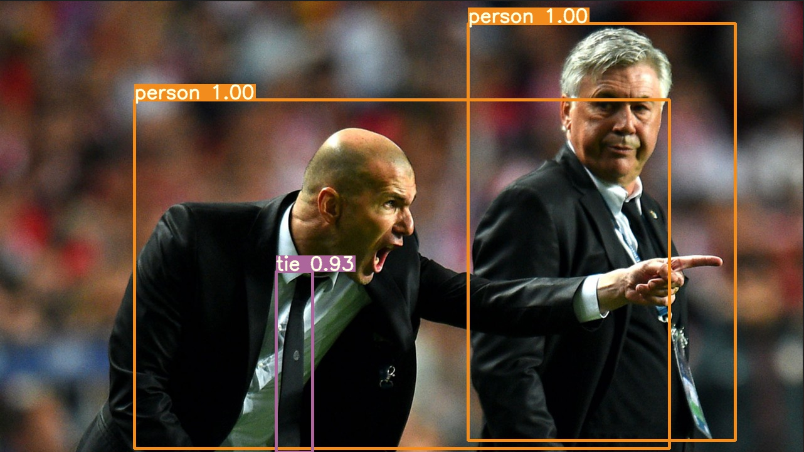

# Single Shot Multibox Detector demo
The job interview for "Turk AI" company

Dataset: https://www.cis.upenn.edu/~jshi/ped_html/PennFudanPed.zip

Desired Input:  

Desired Output:  

Result Output:  

There is a small error region at human on the right but i don't mind it. 
It is not a full project!

# Installation requirements
I am using Anaconda Python distribution  
#### First Pytorch:  
"conda install pytorch torchvision cudatoolkit=10.1 -c pytorch"  
 
#### Second Detectron2 api:  
Not: use linux to make it easy  
"git clone https://github.com/facebookresearch/detectron2.git"  
"cd detectron2 && pip install -e ."  

Or if you are on macOS  
CC=clang CXX=clang++ pip install -e . 
  
Not: If "from detectron2.engine import DefaultPredictor" gives an error please reinstall detectron-2 with compiling all dependencies.

# Expatiation
There is two populer choise for image detection and segmentation. The main difference is R-CNN needs mask(white and black) for where the object should be,
YOLO just try to classify object parts and combine them.

### R-CNN
It is actually helps to detect object on the screen. There is bunch of versions of R-CNN
Mask R-CNN, Fast R-CNN, Faster R-CNN(complete CNN layers), KeyPoint R-CNN. Each of them just gives probability of where the object should be.
Algorithm gives the boxes and classifier classify them. They don't classify the object. Need a backbone or backend neural network to classify
Generally "torchvision" using resnet50, resnet 101 classifiers. If Application should run on mobile, you can change with mobilenet_v2.
Pre masked data helps to identify object. R-CNN detects ends of neural network.  First reduces processing requirement by segmenting image with mask.
Than search the object by mask and backbone classify it.
Mask R-CNN adds an extra branch into Faster R-CNN, which also predicts segmentation masks for each instance.

Pytorch supports lots of classifiers.  
### YOLO(You look only once) 
Splits screen into squares and searchs the objects. It doesn't use mask. YOLO is really really fast, but it slows down if the screen splits into too many pieces.
Yolo struggles with small object because needs to same hole screen. If sampling is low, than YOLO can't detect.
Also needs an anchor to detect. 
  
Not: This name isn't only for image processing or neural networks. I have seen it used for extremly high performance blas kernels.

# How I Made?
First I have made a mask-rcnn with "PennFudan dataset". After short training, 
I have figured out data and training time isn't enough. 
I have found a bigger dataset at mathworks cite, however training was so slow and i have short time to complete because i have other projects to complete.
 
Finally I have tried bunch of pre-trained models and inference apis. I know pytorch, 
i have made my [audio denoising master thesis](https://github.com/develooper1994/MasterThesis/tree/master/Denoiser) before so i decided to go with pytorch inference api and that is the detection api of facebook. it is "DETECTRON-2"
 
It is the first time i have used inference apis. I usually like to research and code it myself.
  
THAKNKS TO TURK AI TO GIVE THAT CHALLANGE. I experienced detectron-2 api.
